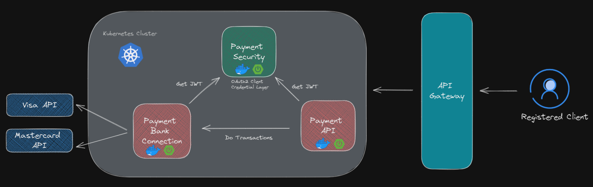
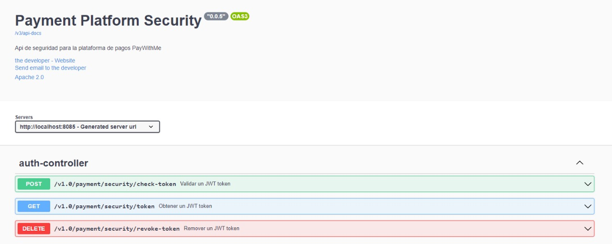
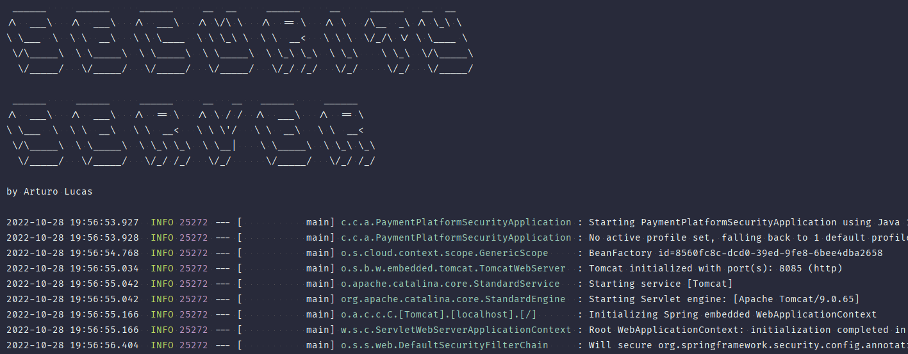

# Payment Platform Security
Security layer of a payment platform, this project implements the 
new version of Spring Security OAuth2 Authorization Server which has deprecated the WebSecurityConfigurerAdapter.

## Technologies and Concepts used

- Oauth2
  - token generation
  - token introspection
  - token revokation
- Spring Security
  - Spring security authorization server
- Client Credentials Grant Type
  - server to server communication
- Java 11
- OpenAPI 3.0 

## Project achitecture



### Project structure
```
.
├── main
│   ├── java
│   │   └── pe
│   │       └── client
│   │           └── custom
│   │               └── app
│   │                   ├── config
│   │                   │   ├── keys
│   │                   │   └── properties
│   │                   ├── controller
│   │                   ├── domain
│   │                   ├── dto
│   │                   ├── exception
│   │                   ├── service
│   │                   │   └── impl
│   │                   └── util
│   │                       └── constant
│   └── resources
│       ├── static
│       └── templates
```

## Project documentation

Access to the path `/swagger-ui/index.html`



## Running


